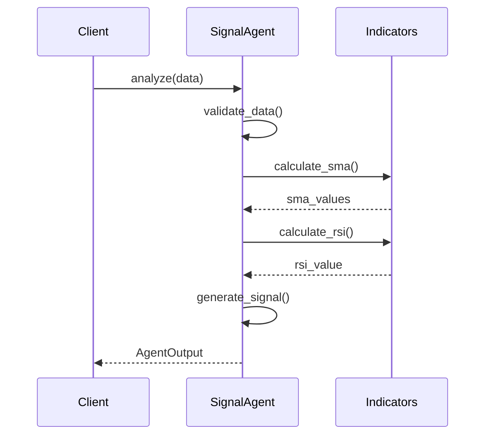

# 📊 Sequence Diagrams - Gold Trading System

**Version:** 2.1.0  
**Last Updated:** October 28, 2025

This document contains sequence diagrams for key workflows in the Gold Trading System.

## Table of Contents

1. [Signal Generation Flow](#signal-generation-flow)
2. [Full Analysis Pipeline](#full-analysis-pipeline)
3. [Backtesting Workflow](#backtesting-workflow)
4. [API Data Retrieval](#api-data-retrieval)
5. [Error Handling Flow](#error-handling-flow)

---

## Signal Generation Flow

### Basic Signal Agent Analysis

```
┌──────┐        ┌─────────────┐        ┌────────────┐        ┌──────────────┐
│Client│        │SignalAgent  │        │ Indicators │        │  AgentOutput │
└──┬───┘        └──────┬──────┘        └─────┬──────┘        └──────┬───────┘
   │                   │                     │                       │
   │  analyze(data)    │                     │                       │
   ├──────────────────>│                     │                       │
   │                   │                     │                       │
   │                   │ validate_data()     │                       │
   │                   ├──────────────┐      │                       │
   │                   │              │      │                       │
   │                   │<─────────────┘      │                       │
   │                   │                     │                       │
   │                   │ calculate_sma()     │                       │
   │                   ├────────────────────>│                       │
   │                   │                     │                       │
   │                   │      sma_values     │                       │
   │                   │<────────────────────┤                       │
   │                   │                     │                       │
   │                   │ calculate_ema()     │                       │
   │                   ├────────────────────>│                       │
   │                   │      ema_values     │                       │
   │                   │<────────────────────┤                       │
   │                   │                     │                       │
   │                   │ calculate_rsi()     │                       │
   │                   ├────────────────────>│                       │
   │                   │      rsi_value      │                       │
   │                   │<────────────────────┤                       │
   │                   │                     │                       │
   │                   │ calculate_macd()    │                       │
   │                   ├────────────────────>│                       │
   │                   │     macd_values     │                       │
   │                   │<────────────────────┤                       │
   │                   │                     │                       │
   │                   │ calculate_bollinger()│                      │
   │                   ├────────────────────>│                       │
   │                   │   bollinger_bands   │                       │
   │                   │<────────────────────┤                       │
   │                   │                     │                       │
   │                   │ calculate_atr()     │                       │
   │                   ├────────────────────>│                       │
   │                   │      atr_value      │                       │
   │                   │<────────────────────┤                       │
   │                   │                     │                       │
   │                   │ calculate_fibonacci()│                      │
   │                   ├────────────────────>│                       │
   │                   │   fibonacci_levels  │                       │
   │                   │<────────────────────┤                       │
   │                   │                     │                       │
   │                   │ _generate_signal()  │                       │
   │                   ├──────────────┐      │                       │
   │                   │              │      │                       │
   │                   │<─────────────┘      │                       │
   │                   │                     │                       │
   │                   │ _calculate_confidence()                     │
   │                   ├──────────────┐      │                       │
   │                   │              │      │                       │
   │                   │<─────────────┘      │                       │
   │                   │                     │                       │
   │                   │      create_output()                        │
   │                   ├────────────────────────────────────────────>│
   │                   │                     │                       │
   │   AgentOutput     │                     │                       │
   │<──────────────────┤                     │                       │
   │                   │                     │                       │
```

---

## Full Analysis Pipeline

### Multi-Agent Analysis Workflow

```
┌──────┐   ┌──────────┐   ┌────────────┐   ┌────────┐   ┌──────────┐   ┌──────────┐
│Client│   │MetaAgent │   │SignalAgent │   │MLAgent │   │DecisionAgt│   │RiskAgent │
└──┬───┘   └────┬─────┘   └─────┬──────┘   └───┬────┘   └─────┬────┘   └────┬─────┘
   │            │               │              │              │             │
   │ analyze()  │               │              │              │             │
   ├───────────>│               │              │              │             │
   │            │               │              │              │             │
   │            │ get_data()    │              │              │             │
   │            ├──────────┐    │              │              │             │
   │            │          │    │              │              │             │
   │            │<─────────┘    │              │              │             │
   │            │               │              │              │             │
   │            │  analyze(data)│              │              │             │
   │            ├──────────────>│              │              │             │
   │            │               │              │              │             │
   │            │               │ calculate_indicators()      │             │
   │            │               ├───────────┐  │              │             │
   │            │               │           │  │              │             │
   │            │               │<──────────┘  │              │             │
   │            │               │              │              │             │
   │            │  SignalOutput │              │              │             │
   │            │<──────────────┤              │              │             │
   │            │               │              │              │             │
   │            │               │  analyze(data)              │             │
   │            ├──────────────────────────────>│             │             │
   │            │               │              │              │             │
   │            │               │              │ engineer_features()        │
   │            │               │              ├──────────┐   │             │
   │            │               │              │          │   │             │
   │            │               │              │<─────────┘   │             │
   │            │               │              │              │             │
   │            │               │              │ model_predict()            │
   │            │               │              ├──────────┐   │             │
   │            │               │              │          │   │             │
   │            │               │              │<─────────┘   │             │
   │            │               │              │              │             │
   │            │               │   MLOutput   │              │             │
   │            │<─────────────────────────────┤              │             │
   │            │               │              │              │             │
   │            │               │              │  analyze([SignalOutput,   │
   │            │               │              │           MLOutput])       │
   │            ├──────────────────────────────────────────>│              │
   │            │               │              │             │              │
   │            │               │              │             │ aggregate() │
   │            │               │              │             ├─────────┐   │
   │            │               │              │             │         │   │
   │            │               │              │             │<────────┘   │
   │            │               │              │             │              │
   │            │               │              │  DecisionOutput            │
   │            │<─────────────────────────────────────────┤              │
   │            │               │              │             │              │
   │            │               │              │             │ assess(decision)
   │            ├──────────────────────────────────────────────────────────>│
   │            │               │              │             │              │
   │            │               │              │             │              │ calculate_position_size()
   │            │               │              │             │              ├───────────┐
   │            │               │              │             │              │           │
   │            │               │              │             │              │<──────────┘
   │            │               │              │             │              │
   │            │               │              │             │   RiskOutput │
   │            │<─────────────────────────────────────────────────────────┤
   │            │               │              │             │              │
   │            │ create_final_decision()      │             │              │
   │            ├──────────┐   │              │             │              │
   │            │          │   │              │             │              │
   │            │<─────────┘   │              │             │              │
   │            │               │              │             │              │
   │  Decision  │               │              │             │              │
   │<───────────┤               │              │             │              │
   │            │               │              │             │              │
```

---

## Backtesting Workflow

### Strategy Backtesting Process

```
┌──────┐     ┌────────────────┐     ┌──────────┐     ┌─────────┐     ┌─────────┐
│Client│     │BacktestEngine  │     │ Strategy │     │ Metrics │     │ Report  │
└──┬───┘     └───────┬────────┘     └────┬─────┘     └────┬────┘     └────┬────┘
   │                 │                   │               │               │
   │  run_backtest() │                   │               │               │
   ├────────────────>│                   │               │               │
   │                 │                   │               │               │
   │                 │ initialize()      │               │               │
   │                 ├─────────────┐     │               │               │
   │                 │             │     │               │               │
   │                 │<────────────┘     │               │               │
   │                 │                   │               │               │
   │                 │ load_historical_data()            │               │
   │                 ├─────────────┐     │               │               │
   │                 │             │     │               │               │
   │                 │<────────────┘     │               │               │
   │                 │                   │               │               │
   │                 │ ╔═════════════════════════════════╗               │
   │                 │ ║  Loop: For each candle         ║               │
   │                 │ ╚═════════════════════════════════╝               │
   │                 │                   │               │               │
   │                 │  on_candle(data)  │               │               │
   │                 ├──────────────────>│               │               │
   │                 │                   │               │               │
   │                 │                   │ update_indicators()           │
   │                 │                   ├────────┐      │               │
   │                 │                   │        │      │               │
   │                 │                   │<───────┘      │               │
   │                 │                   │               │               │
   │                 │  should_buy()?    │               │               │
   │                 ├──────────────────>│               │               │
   │                 │                   │               │               │
   │                 │      True/False   │               │               │
   │                 │<──────────────────┤               │               │
   │                 │                   │               │               │
   │            [if True]                │               │               │
   │                 │                   │               │               │
   │                 │ execute_buy()     │               │               │
   │                 ├─────────────┐     │               │               │
   │                 │             │     │               │               │
   │                 │<────────────┘     │               │               │
   │                 │                   │               │               │
   │                 │  should_sell()?   │               │               │
   │                 ├──────────────────>│               │               │
   │                 │                   │               │               │
   │                 │      True/False   │               │               │
   │                 │<──────────────────┤               │               │
   │                 │                   │               │               │
   │            [if True]                │               │               │
   │                 │                   │               │               │
   │                 │ execute_sell()    │               │               │
   │                 ├─────────────┐     │               │               │
   │                 │             │     │               │               │
   │                 │<────────────┘     │               │               │
   │                 │                   │               │               │
   │                 │ update_equity()   │               │               │
   │                 ├─────────────┐     │               │               │
   │                 │             │     │               │               │
   │                 │<────────────┘     │               │               │
   │                 │                   │               │               │
   │                 │ ╔═════════════════════════════════╗               │
   │                 │ ║  End Loop                      ║               │
   │                 │ ╚═════════════════════════════════╝               │
   │                 │                   │               │               │
   │                 │                   │  calculate_metrics()          │
   │                 ├──────────────────────────────────>│               │
   │                 │                   │               │               │
   │                 │                   │               │ compute_sharpe()
   │                 │                   │               ├────────┐      │
   │                 │                   │               │        │      │
   │                 │                   │               │<───────┘      │
   │                 │                   │               │               │
   │                 │                   │               │ compute_drawdown()
   │                 │                   │               ├────────┐      │
   │                 │                   │               │        │      │
   │                 │                   │               │<───────┘      │
   │                 │                   │               │               │
   │                 │                   │      Metrics  │               │
   │                 │<─────────────────────────────────┤               │
   │                 │                   │               │               │
   │                 │                   │               │  generate_report()
   │                 ├──────────────────────────────────────────────────>│
   │                 │                   │               │               │
   │                 │                   │               │               │ create_html()
   │                 │                   │               │               ├─────────┐
   │                 │                   │               │               │         │
   │                 │                   │               │               │<────────┘
   │                 │                   │               │               │
   │                 │                   │               │        Report │
   │                 │<─────────────────────────────────────────────────┤
   │                 │                   │               │               │
   │  BacktestResult │                   │               │               │
   │<────────────────┤                   │               │               │
   │                 │                   │               │               │
```

---

## API Data Retrieval

### Twelve Data API Integration

```
┌──────┐        ┌────────────────┐        ┌──────────┐        ┌──────────┐
│Client│        │TwelveDataClient│        │API Server│        │ Validator│
└──┬───┘        └────────┬───────┘        └────┬─────┘        └────┬─────┘
   │                     │                     │                   │
   │ get_time_series()   │                     │                   │
   ├────────────────────>│                     │                   │
   │                     │                     │                   │
   │                     │ check_rate_limit()  │                   │
   │                     ├──────────┐          │                   │
   │                     │          │          │                   │
   │                     │<─────────┘          │                   │
   │                     │                     │                   │
   │                     │ build_request()     │                   │
   │                     ├──────────┐          │                   │
   │                     │          │          │                   │
   │                     │<─────────┘          │                   │
   │                     │                     │                   │
   │                     │  HTTP GET /time_series                  │
   │                     ├────────────────────>│                   │
   │                     │                     │                   │
   │                     │                     │ process_request() │
   │                     │                     ├──────────┐        │
   │                     │                     │          │        │
   │                     │                     │<─────────┘        │
   │                     │                     │                   │
   │                     │  JSON Response      │                   │
   │                     │<────────────────────┤                   │
   │                     │                     │                   │
   │                     │ validate_response() │                   │
   │                     ├────────────────────────────────────────>│
   │                     │                     │                   │
   │                     │                     │     validate_schema()
   │                     │                     │                   ├─────┐
   │                     │                     │                   │     │
   │                     │                     │                   │<────┘
   │                     │                     │                   │
   │                     │                     │     validate_data()
   │                     │                     │                   ├─────┐
   │                     │                     │                   │     │
   │                     │                     │                   │<────┘
   │                     │                     │                   │
   │                     │                     │       Valid       │
   │                     │<───────────────────────────────────────┤
   │                     │                     │                   │
   │                     │ parse_to_models()   │                   │
   │                     ├──────────┐          │                   │
   │                     │          │          │                   │
   │                     │<─────────┘          │                   │
   │                     │                     │                   │
   │                     │ cache_data()        │                   │
   │                     ├──────────┐          │                   │
   │                     │          │          │                   │
   │                     │<─────────┘          │                   │
   │                     │                     │                   │
   │    MarketData       │                     │                   │
   │<────────────────────┤                     │                   │
   │                     │                     │                   │
```

---

## Error Handling Flow

### Comprehensive Error Handling

```
┌──────┐        ┌───────────┐        ┌──────────┐        ┌────────────┐
│Client│        │ Agent     │        │ErrorHandler│      │Logger      │
└──┬───┘        └─────┬─────┘        └─────┬────┘        └─────┬──────┘
   │                  │                    │                   │
   │  analyze(data)   │                    │                   │
   ├─────────────────>│                    │                   │
   │                  │                    │                   │
   │              try {                    │                   │
   │                  │                    │                   │
   │                  │ validate_data()    │                   │
   │                  ├──────────┐         │                   │
   │                  │          │         │                   │
   │                  │<─────────┘         │                   │
   │                  │                    │                   │
   │                  │ calculate_indicators()                 │
   │                  ├──────────┐         │                   │
   │                  │          │         │                   │
   │                  │<─────────┘         │                   │
   │                  │                    │                   │
   │                  │ [Error occurs]     │                   │
   │                  │ Exception thrown   │                   │
   │                  │                    │                   │
   │              } catch (Error) {        │                   │
   │                  │                    │                   │
   │                  │  handle_error(e)   │                   │
   │                  ├───────────────────>│                   │
   │                  │                    │                   │
   │                  │                    │ classify_error()  │
   │                  │                    ├──────────┐        │
   │                  │                    │          │        │
   │                  │                    │<─────────┘        │
   │                  │                    │                   │
   │                  │                    │  [Is Recoverable?]│
   │                  │                    │                   │
   │                  │                    │ ╔═══════════════╗ │
   │                  │                    │ ║  Yes          ║ │
   │                  │                    │ ╚═══════════════╝ │
   │                  │                    │                   │
   │                  │                    │ log_warning()     │
   │                  │                    ├──────────────────>│
   │                  │                    │                   │
   │                  │                    │                   │ write_log()
   │                  │                    │                   ├────────┐
   │                  │                    │                   │        │
   │                  │                    │                   │<───────┘
   │                  │                    │                   │
   │                  │                    │ retry_operation() │
   │                  │                    ├──────────┐        │
   │                  │                    │          │        │
   │                  │                    │<─────────┘        │
   │                  │                    │                   │
   │                  │                    │ ╔═══════════════╗ │
   │                  │                    │ ║  Success      ║ │
   │                  │                    │ ╚═══════════════╝ │
   │                  │                    │                   │
   │                  │  Recovery Success  │                   │
   │                  │<───────────────────┤                   │
   │                  │                    │                   │
   │                  │ return_result()    │                   │
   │                  ├──────────┐         │                   │
   │                  │          │         │                   │
   │                  │<─────────┘         │                   │
   │                  │                    │                   │
   │     Result       │                    │                   │
   │<─────────────────┤                    │                   │
   │                  │                    │                   │
   │                  │                    │                   │
   │                  │                    │ ╔═══════════════╗ │
   │                  │                    │ ║  No           ║ │
   │                  │                    │ ║(Non-recoverable)║
   │                  │                    │ ╚═══════════════╝ │
   │                  │                    │                   │
   │                  │                    │ log_error()       │
   │                  │                    ├──────────────────>│
   │                  │                    │                   │
   │                  │                    │                   │ write_error_log()
   │                  │                    │                   ├────────┐
   │                  │                    │                   │        │
   │                  │                    │                   │<───────┘
   │                  │                    │                   │
   │                  │                    │ create_fallback() │
   │                  │                    ├──────────┐        │
   │                  │                    │          │        │
   │                  │                    │<─────────┘        │
   │                  │                    │                   │
   │                  │  Fallback Result   │                   │
   │                  │<───────────────────┤                   │
   │                  │                    │                   │
   │  FallbackResult  │                    │                   │
   │<─────────────────┤                    │                   │
   │                  │                    │                   │
```

---

## Notes

### Diagram Conventions

- **Solid arrows (─>):** Synchronous calls
- **Dashed arrows (-->):** Asynchronous calls
- **Return arrows (<─):** Return values
- **Boxes with corners:** Components/Objects
- **Boxes with double lines:** Loops or conditions
- **Self-arrows:** Internal methods

### ASCII Diagram Tools

These diagrams can be edited using:
- **Online:** https://textik.com/
- **VS Code Extension:** ASCII Diagram Draw
- **CLI Tool:** graph-easy (Perl module)

### Mermaid Alternative

For interactive diagrams, consider using Mermaid syntax:



---

**For updates or corrections to these diagrams, please submit a pull request.**

**License:** MIT License  
**Copyright:** © 2025 Gold Trading System Team
